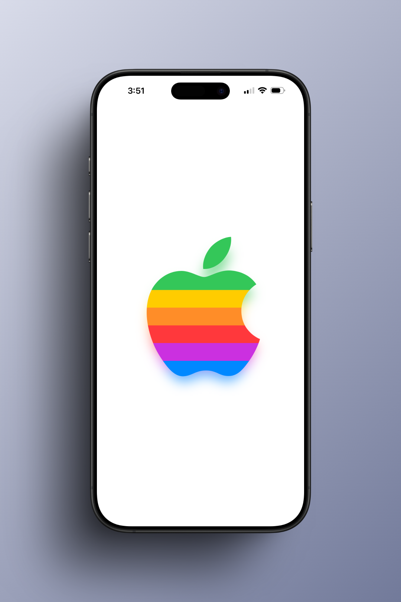

# ShadowGlow

ShadowGlow is a lightweight SwiftUI library that creates a realistic glow effect by mirroring the view's content itself, rather than using a simple shadow color. This creates a vibrant, dynamic "glow" illusion that matches your view's actual colors.

## Preview

<div align="leading">
  
</div>

## Features

- 🌟 **Dynamic Glow**: Uses the view's own content to generate the shadow, preserving colors and gradients.
- 🎨 **Highly Customizable**: Adjust opacity, blur, scale, and offset to get the perfect look.
- 🌗 **Dark Mode Support**: Intelligent handling of color schemes, with an option to disable the glow in dark mode.
- 📱 **Multi-Platform**: Supports iOS, macOS, visionOS, tvOS, and watchOS.

## Installation

### Swift Package Manager

1. In Xcode, select **File** > **Add Packages...**
2. Paste the URL of this repository into the search bar:
   ```
   https://github.com/juanwilliman/ShadowGlow
   ```
3. Select **ShadowGlow** and click **Add Package**.

### Manual Installation (Gist)

If you prefer not to add the package as a dependency, you can simply copy and paste the code from the following Gist directly into your project:

[View Gist on GitHub](https://gist.github.com/juanwilliman/7b423c658dcb006964addf53bf87da31)

## Usage

Import `ShadowGlow` in your SwiftUI view and apply the `.shadowGlow()` modifier to any view.

```swift
import SwiftUI
import ShadowGlow

struct ContentView: View {
    var body: some View {
        Image(systemName: "star.fill")
            .resizable()
            .foregroundStyle(.yellow)
            .frame(width: 100, height: 100)
            .shadowGlow() // Applies default glow
    }
}
```

### Customization

You can customize the glow effect by passing parameters to the modifier:

```swift
Text("Hello, World!")
    .font(.largeTitle)
    .foregroundStyle(.linearGradient(colors: [.blue, .purple], startPoint: .topLeading, endPoint: .bottomTrailing))
    .shadowGlow(
        opacity: 0.5,       // Transparency of the glow
        blurRadius: 15,     // Softness of the glow
        scale: 0.9,         // Size of the shadow relative to the view
        x: 0,               // Horizontal offset
        y: 10,              // Vertical offset
        showInDarkMode: true // Whether to show the glow in dark mode
    )
```

## Parameters

| Parameter | Type | Default | Description |
|-----------|------|---------|-------------|
| `opacity` | `CGFloat` | `0.6` | The opacity of the shadow glow layer. |
| `blurRadius` | `CGFloat` | `13` | The radius of the blur applied to the shadow layer. |
| `scale` | `CGFloat` | `0.95` | The scale of the shadow layer relative to the content. |
| `x` | `CGFloat` | `0.0` | The horizontal offset of the shadow. |
| `y` | `CGFloat` | `20.0` | The vertical offset of the shadow. |
| `showInDarkMode` | `Bool` | `true` | Determines if the glow effect is visible when the color scheme is dark. |

## Requirements

- iOS 15.0+
- macOS 12.0+
- visionOS 1.0+
- tvOS 15.0+
- watchOS 8.0+
- Swift 5.5+

## License

This project is licensed under the MIT License - see the [LICENSE](LICENSE) file for details.

